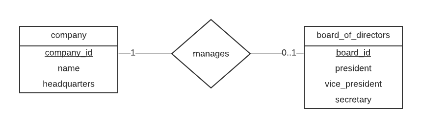

# csi2532 Devoir 1
Firas Jribi 300084463

## Part A

### A1

#### A1a


#### A1b


#### A1c


### A2
[ER #4](assets/A2.png)


### A3

#### A3a
```
∏(σ availability.date = "March 2, 2020" Λ availability.available = TRUE Λ availability.office_id = office.office_id Λ office.city = "Ottawa" (office X availability))

```
#### A3b
```
∏ user.name, user.email, office.name, office.city, rent.date, rent.daily_rate (σ rent.departure_date < "January 31, 2020" Λ rent.arrival_date > "January 1, 2020" (office X rent X user))

```


## Part B

### B1

#### B1a
[SQL #1](assets/B1a.png)

#### B1b
[SQL #2](assets/B1b.png)

#### B1c
[SQL #3](assets/B1c1.png)
Le code ne s'execute pas et on obtient cette erreur:

```
42803 column "users_2019.id" must appear in the GROUP BY clause or be used in an aggregate function
```
Comme on utilise une fonction d'aggregation ici (count), on doit regrouper toutes les colonnes. La colonne ID manquait du code et apres ce que on l'ajoute, le code fonctionne parfaitement.
```sql
WITH users_2019 (id, name) AS
 (SELECT *
 FROM users
 WHERE join_date BETWEEN '2019-01-01' AND '2019-12-31')
SELECT id,
 name,
 count(licenses.access_code) AS num
FROM users_2019
LEFT JOIN licenses ON licenses.user_id = id
GROUP BY ID, NAME
ORDER BY num DESC;

```
[SQL #4](assets/B1c2.png)


### B2

#### B2a
```sql
SELECT *
FROM users 
WHERE join_date < '2020-01-01';

```
[SQL #5](assets/B2a.png)

#### B2b
```sql
SELECT NAME, count(licenses.access_code) AS number_of_software_licenses
FROM users
LEFT JOIN licenses ON licenses.user_id = users.id
GROUP BY ID, NAME
ORDER BY number_of_software_licenses DESC, NAME ASC;

```
[SQL #6](assets/B2b.png)

#### B2c
```sql
INSERT INTO users (id, name, join_date)
VALUES
 (15, 'firas', '2018-01-01'),
 (16, 'anon', '2019-01-02');

INSERT INTO licenses (user_id, software_name, access_code)
VALUES
 (15, 'MS Word', 'def458'),
 (15, 'Sketch', 'x2y3z7');


SELECT NAME, count(licenses.access_code) AS number_of_software_licenses
FROM users
LEFT JOIN licenses ON licenses.user_id = users.id
GROUP BY ID, NAME
ORDER BY number_of_software_licenses DESC, NAME ASC;

```
[SQL #7](assets/B2c.png)

#### B2d
```sql
UPDATE softwares SET version = '51' WHERE name = 'Sketch';
```
[SQL #8](assets/B2d.png)

#### B3a
```sql
BEGIN;

ALTER TABLE licenses ADD COLUMN IF NOT EXISTS software_version varchar(100);

UPDATE licenses
SET software_version = softwares.version
FROM softwares
WHERE softwares.name = licenses.software_name;

COMMIT;
```
[SQL #9](assets/B3a.png)

#### B3b
```sql
BEGIN;
ALTER TABLE softwares
DROP CONSTRAINT softwares_pkey,
ADD PRIMARY KEY(name, version);
COMMIT;
```
[SQL #10](assets/B3b.png)

#### B3c
```sql
BEGIN;

ALTER TABLE licenses
DROP CONSTRAINT licenses_pkey,
ADD PRIMARY KEY(user_id, software_name, software_version);

INSERT INTO licenses (user_id, software_name, software_version, access_code)
VALUES
 ((SELECT  id FROM users WHERE users.name = 'andrew'),'Sketch', '52', 'xxxyyy111');
 
COMMIT;
```
[SQL #11](assets/B3c.png)


#### B3d
```sql
BEGIN;

INSERT INTO licenses (user_id, software_name, software_version, access_code)
SELECT l.user_id, 'Sketch','52','1monthfree'
FROM licenses as l 
WHERE user_id NOT IN (SELECT user_id FROM licenses WHERE software_name = 'Sketch'
                      AND software_version = '52')
                      AND software_name = 'Sketch'
                      AND software_version <> '52';

COMMIT;
```
[SQL #12](assets/B3d.png)